# How RAG + Gemma 3 Works Together

To understand how Retrieval-Augmented Generation (RAG) works with Gemma, it helps to see the exact flow of data. 

Without RAG, if you ask Gemma a highly specific question, it might guess or "hallucinate" an answer. With RAG, we force Gemma to read our verified database *before* it speaks.

## The Architecture Flow

```mermaid
sequenceDiagram
    participant User
    participant FastAPI (Backend)
    participant ChromaDB (Vector DB)
    participant Ollama (Embeddings)
    participant Ollama (Gemma 3)

    User->>FastAPI: "I want a vegan meal in Tamil Nadu"
    
    rect rgb(20, 40, 80)
        Note right of FastAPI: Step 1: RETRIEVAL (The "R")
        FastAPI->>Ollama (Embeddings): Convert text to numbers (nomic-embed-text)
        Ollama (Embeddings)-->>FastAPI: [0.12, 0.45, -0.89...]
        FastAPI->>ChromaDB: "Find closest matching recipes/rules"
        ChromaDB-->>FastAPI: Returns Context (e.g., "Use Soy Chunks", "Recipe: Pesarattu")
    end
    
    rect rgb(80, 20, 80)
        Note right of FastAPI: Step 2: AUGMENTATION (The "A")
        FastAPI->>FastAPI: Combine Context + User Prompt into one massive hidden prompt
    end

    rect rgb(20, 80, 40)
        Note right of FastAPI: Step 3: GENERATION (The "G")
        FastAPI->>Ollama (Gemma 3): Send augmented prompt
        Ollama (Gemma 3)-->>FastAPI: Returns personalized meal plan based ONLY on context
    end
    
    FastAPI-->>User: Beautifully formatted response
```



## How we wrote this in Code

If you look inside our `/home/hello/Fitness-AI/backend/main.py` file, you can see exactly where this happens in the `/api/rag_generate` endpoint:

### 1. Retrieval
First, we take the user's prompt and search ChromaDB for the most relevant nutrition rules and real recipes:
```python
# Fetches the top 5 most relevant documents from ChromaDB
context = get_context(request.prompt) 
```

### 2. Augmentation
Next, we build a "System Prompt". The user never sees this. We essentially trick Gemma by injecting our data directly into its instructions:
```python
augmented_prompt = f"""You are an expert AI Nutritionist. Use the following context to answer the user's request. If the context does not contain the answer, rely on your general knowledge but prioritize the context.

Context:
{context}  <-- This is where the ChromaDB data is injected!

User Request: {request.prompt}
"""
```

### 3. Generation
Finally, we send this massive string of text to Gemma 3 4B running in Ollama. Gemma reads the context, realizes it has to use it, and generates the final response:
```python
ollama_url = "http://localhost:11434/api/generate"
payload = {
    "model": "gemma3:4b",
    "prompt": augmented_prompt, # We send the augmented prompt, not the user's original one
    "stream": False
}
response = requests.post(ollama_url, json=payload)
```

## Summary
Gemma 3 is the "brain" (it knows English, it knows how to reason, and it knows how to format a nice meal plan). But ChromaDB is the "textbook". We make Gemma read a page of the textbook (the RAG context) right before it answers the user's question!
